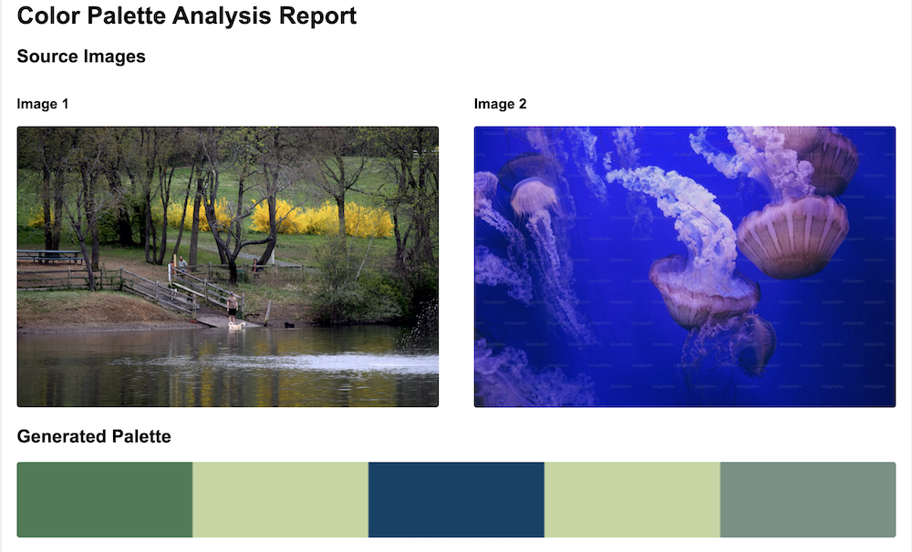
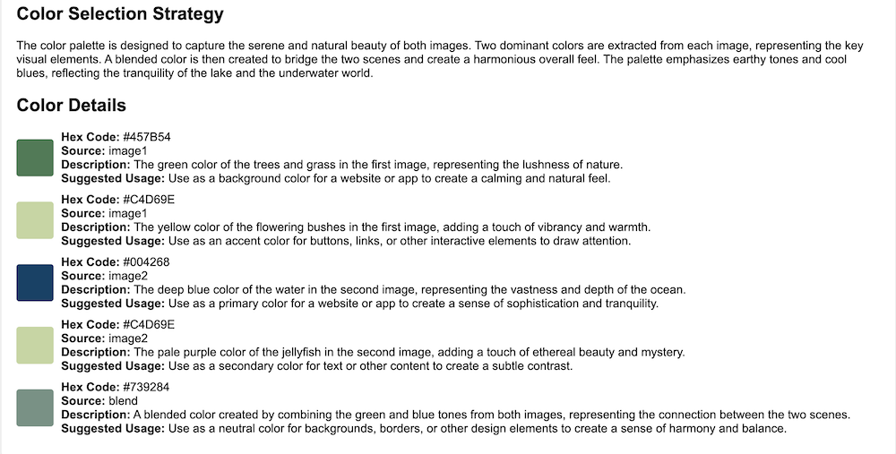

# LearnNation Assignment

## Project Narrative: Color Palette Analysis Tool

The design department has been creating stunning case studies for their educational platform, but they've identified a critical need: automating their color palette documentation process. Currently, their designers spend hours manually creating color analysis reports for each project, taking valuable time away from their creative work.

Your mission as a developer is to create a specialized app that will revolutionize how LearnNation's design team documents and shares their color decisions in their case studies. This app will automatically generate professional HTML reports that analyze color palettes derived from their inspiration images, complete with visual representations, technical specifications, and strategic recommendations for color usage.

The design team envisions uploading two inspiration images and receiving a beautifully formatted HTML document that showcases everything from the source imagery to detailed color specifications. This report will not only serve as documentation but will also be integrated into their online case studies, helping students and clients understand the thoughtful color selection process behind LearnNation's design work.

As Sarah, the Design Director, explains: "We need a tool that thinks like a designer but works like a developer. Each color report should tell a story - from the inspiration images that sparked the palette to the strategic reasoning behind each color choice. This isn't just about showing colors; it's about documenting our design thinking in a way that's both beautiful and informative."

## Technical Overview

**Note:** This is a Yellow Light Assignment. This means, as always and in every assignment, read documentation as much as possible, but you may also want to leverage the use of AI to help you complete the assignment, and as always, you **must** be able to explain every line of code in your solution.

The application will need to:

1. **Image Input and Validation**
   - Accept two inspiration images via URLs
   - Validate image URLs and file extensions
   - Support common image formats (.jpg, .jpeg, .png, .gif)
   - Download and temporarily store images for processing

2. **AI-Powered Color Analysis**
   - Interface with Google's Gemini API for image analysis
   - Configure AI model parameters for consistent results
   - Extract dominant colors from each source image
   - Generate harmonious blended colors
   - Provide strategic color selection rationale

3. **Color Palette Generation**
   - Create a balanced 5-color palette:
     - 2 colors from first inspiration image
     - 2 colors from second inspiration image
     - 1 blended color combining elements from both
   - Generate hex codes for each color
   - Create color usage recommendations
   - Document color sources and descriptions

4. **HTML Report Generation**
   - Create professional, responsive HTML structure
   - Implement clean, modern CSS styling
   - Include components:
     - Professional headers and structure
     - Side-by-side display of inspiration images
     - Generated palette visualization
     - Color selection strategy explanation
     - Detailed color analysis for each shade
     - Technical specifications (hex codes, sources)
**Note:** There is an [HTML Skeleton](./html-skeleton.md) that you can use as a reference for the HTML structure.

5. **Image Processing and Storage**
   - Convert images to base64 for HTML embedding
   - Generate visual palette representation
   - Handle temporary file management
   - Clean up downloaded files after processing

6. **Error Handling and Validation**
   - Validate all user inputs
   - Handle API connection issues
   - Manage file download errors
   - Provide clear error messages
   - Implement proper exception handling

7. **Security Considerations**
   - Secure API key management using environment variables
   - Validate and sanitize URL inputs
   - Implement file extension restrictions
   - Handle sensitive data appropriately

8. **User Interface**
   - Accept user input for image URLs
   - Allow custom output filename selection
   - Provide progress feedback during processing
   - Display clear success/error messages

## Screenshot of the HTML report
You may choose this layout or create your own.

## Video Demo

Here is a video demo of the potential user walkthrough of the app:

[Palette Report Demo](https://drive.google.com/file/d/1uVI1LSr7oFPIpy5seE5Cs2MG3ixfTot0/view?usp=sharing)

## Suggestion on Building the App

Break your app down into smaller functions and test each function in isolation. Once all functions are working as expected, then you can wire them together in the main app.

## Guides

These resources will help you complete the assignment:

- [Virtual Environment Setup](https://github.com/jdrichards-pursuit/python-virtual-environment-setup) - this is a guide to help you set pythonvirtual environment to run the app.
- [Python Library Imports](./imports.md) - this is a list of all the external libraries you will need to install and import.
- [Complete Function Guide](./complete-function-guide.md) - this is a list of all the functions in the app and a description of what each function does. (**Note:** Some functions already exist from your recent training lessons.)
- [Function Flow](./function-flow.md) - this is a walkthrough of the function calls and their flow as well as what other functions might be invoked within each function.
- [User Steps](./user-steps.md) - this is a walkthrough of the user steps to use the app.
- [HTML Skeleton](./html-skeleton.md) - this is an example of the HTML structure you can use as a reference for the HTML structure.